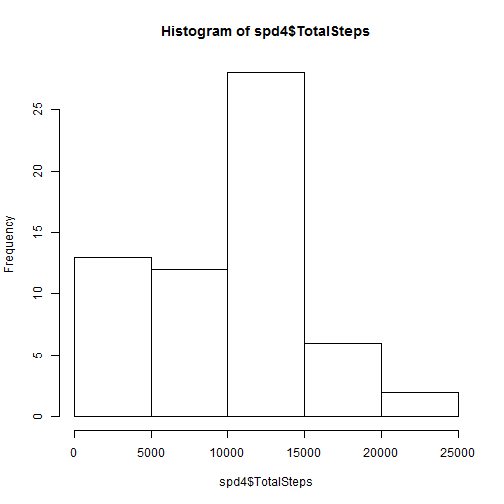
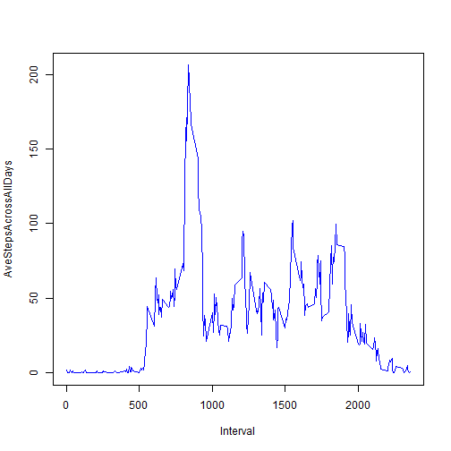
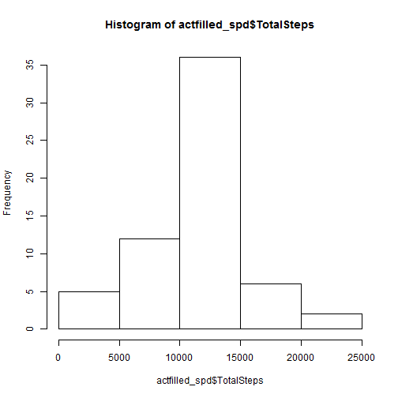
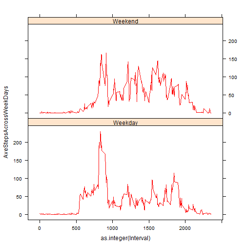

Reproducible Research: Courera Assignement Project1

# Loading and preprocessing the activity data : activity.csv
From the read data (act1 dataframe), using aggregate function find total number of steps per day excluding NA in steps column. 
Agregated data with total number of steps per day is collected in spd4 data frame


```r
act1<- read.csv("activity.csv", na.strings="NA", colClasses = "character")
spd4<-aggregate(as.integer(act1$steps),list(act1$date), FUN= "sum", na.rm=TRUE)
colnames(spd4)<-c("Dates", "TotalSteps")
```
Histogram of the total number of steps taken each day


```r
hist(spd4$`TotalSteps`)
```

 

Mean of the total number of steps taken per day 


```r
mean(spd4$TotalSteps)
```

```
## [1] 9354.23
```

Median of the total number of steps taken per day


```r
median(spd4$TotalSteps)
```

```
## [1] 10395
```

#Average daily activity pattern
Find average number of steps, averaged across all days in each 5 min time interval


```r
aveStpsAcrDays1<-aggregate(as.integer(act1$steps),list(act1$interval), FUN= "mean", na.rm=TRUE)

colnames(aveStpsAcrDays1) <- c("Interval", "AveStepsAcrossAllDays")

aveStpsAcrDays2<-aveStpsAcrDays1[sort.list(as.integer(aveStpsAcrDays1$Interval)),]
```
Draw time series plot (i.e. type = "l") of the 5-minute interval (x-axis) and the average number of steps taken, averaged across all days (y-axis)
 

```r
with(aveStpsAcrDays2, plot(Interval, AveStepsAcrossAllDays, type ="l", col="blue"))
```

 

5-minute interval, on average across all the days in the dataset, contains the maximum number of steps is,


```r
as.integer(subset(aveStpsAcrDays1, aveStpsAcrDays1$AveStepsAcrossAllDays == max(aveStpsAcrDays1$AveStepsAcrossAllDays))$Interval)
```

```
## [1] 835
```

#Inputing missing values
Total number of missing values in the dataset (i.e. the total number of rows with NAs)


```r
actNA<- act1[is.na(act1$steps), ]
numNaRow<-length(actNA$steps)
numNaRow
```

```
## [1] 2304
```
Filling in all of the missing values in the dataset. find the 5 minute time interval with NA steps and set it with average number of steps for that interval across all days, calculated above


```r
for(i in 1:length(actNA$interval))
{
  actNA[i,]$steps = aveStpsAcrDays2[aveStpsAcrDays2$Interval==actNA[i,]$interval,]$AveStepsAcrossAllDays
  
}
```
Creating new data set with all NA values filled with average number of steps for that interval across all days

```r
act2<-subset(act1, !is.na(act1$steps))

actFilledNas<-rbind(act2, actNA)

actfilled_spd<-aggregate(as.integer(actFilledNas$steps),list(actFilledNas$date), FUN= "sum", na.rm=TRUE)
colnames(actfilled_spd)<-c("Dates", "TotalSteps")
```
Draw histogram of the total number of steps taken each day in NA filled data set


```r
hist(actfilled_spd$`TotalSteps`)
```

 

Mean of the total number of steps taken per day in NA filled Data set


```r
mean(actfilled_spd$TotalSteps)
```

```
## [1] 10749.77
```

Median of the total number of steps taken per day in NA filled Data set


```r
median(actfilled_spd$TotalSteps)
```

```
## [1] 10641
```
As expected mean and median of total number of steps taken per day from NA filled data set are different from NA not filled data set. With additional number of steps  filled in place of NA, mean and median seen incresed in NA filled data set

# Cmparision in activity patterns between weekdays and weekends

Create a new factor variable in the dataset with two levels - "weekday" and "weekend" indicating whether a given date is a weekday or weekend day.


```r
daytype<-weekdays(as.Date.character(actFilledNas$date))

weekdaytype<-daytype

for (i in 1:length(daytype))
{
  if(daytype[i] == "Saturday" || daytype[i] == "Sunday")
  {
    weekdaytype[i] = "Weekend"
  }
  else
  {
    weekdaytype[i] = "Weekday"
  }
}

actFilledNaswDaytype<-actFilledNas
actFilledNaswDaytype$DayType<-weekdaytype

weekdaydata<-subset(actFilledNaswDaytype, actFilledNaswDaytype$DayType=="Weekday")
weekenddata<-subset(actFilledNaswDaytype, actFilledNaswDaytype$DayType=="Weekend")

aveStpsAcrWeekdays1<-aggregate(as.integer(weekdaydata$steps),list(weekdaydata$interval), FUN= "mean", na.rm=TRUE)

colnames(aveStpsAcrWeekdays1) <- c("Interval", "AveStepsAcrossWeekDays")

aveStpsAcrWeekdays2<-aveStpsAcrWeekdays1[sort.list(as.integer(aveStpsAcrWeekdays1$Interval)),]
aveStpsAcrWeekdays2$DayType<-"Weekday"


aveStpsAcrWeekends1<-aggregate(as.integer(weekenddata$steps),list(weekenddata$interval), FUN= "mean", na.rm=TRUE)

colnames(aveStpsAcrWeekends1) <- c("Interval", "AveStepsAcrossWeekDays")

aveStpsAcrWeekends2<-aveStpsAcrWeekends1[sort.list(as.integer(aveStpsAcrWeekends1$Interval)),]
aveStpsAcrWeekends2$DayType<-"Weekend"
aveStepsAcrAllDaysbyweekType<-rbind(aveStpsAcrWeekdays2, aveStpsAcrWeekends2)
```
Make a panel plot containing a time series plot (i.e. type = "l") of the 5-minute interval (x-axis) and the average number of steps taken, averaged across all weekday days or weekend days (y-axis).  


```r
library(lattice)

xyplot(AveStepsAcrossWeekDays~as.integer(Interval)|DayType, data=aveStepsAcrAllDaysbyweekType, layout = c(1, 2), type="l", col=c("red"))
```

 
